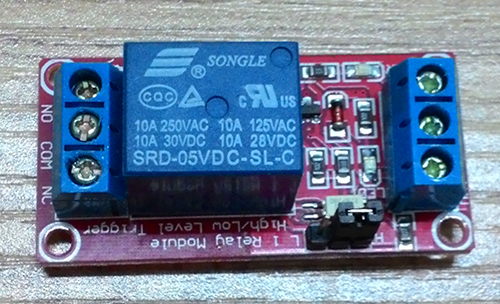
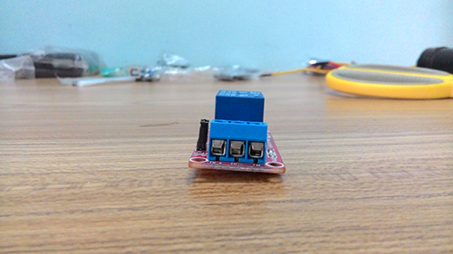
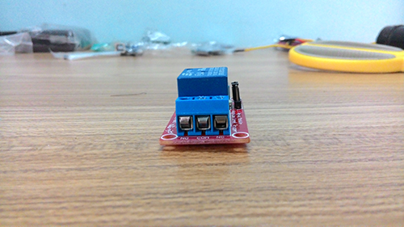
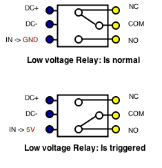
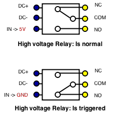
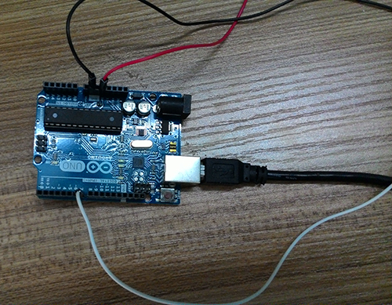
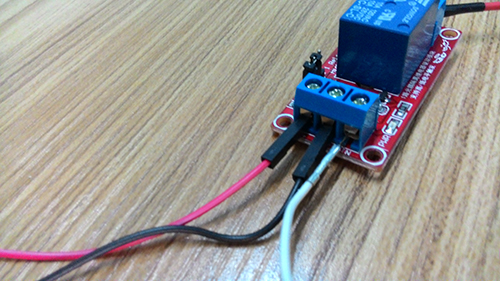
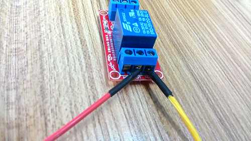

# Relay guide notes

Relay is an electrical switch that used to turn on/off the current by electrical signal. Relay is also used to control a circuit by a low-power signal (with complete electrical isolation between control and controlled circuits).








In relay's body, you can see the descriptions:
+ 10A 250VAC.
+ 10A 125VAC.
+ 10A 30VDC.
+ 10A 28VDC.
+ SRD-05VDC-SL-C.

They mean:
+ 10A 250VAC: The max current intensity of connection, where voltage is equal or lesser 250V (AC), is 10A.
+ 10A 125VAC: The max current intensity of connection, where voltage is equal or lesser 125V (AC), is 10A.
+ 10A 30VDC: The max current intensity of connection, where voltage is equal or lesser 30V (DC), is 10A.
+ 10A 28VDC: The max current intensity of connection, where voltage is equal or lesser 28V (DC), is 10A.
+ SRD-05VDC-SL-C: Voltage of signal to control circuit is 5V.

# State of relay

Because relay is a switch, it has two main state: closed and open.
+ Closed: While closing, the relay allows keep current in circuit. It called is "closed circuit".
+ Open: While opening, the relay interrupts circuit and current doesn't work in circuit. It called is "open circuit".


# Relay's connections

In relay, we have six connections. Three is used to control the state of relay, three used to connect to circuit (to make circuit is closed or open)


Three connections are used to control the state of relay:
+ DC+: Electrode positive. In this article, we connect wire with 5V to this connection.
+ DC-: Electrode positive. Connect to GND.
+ IN: Signal connection that is used to control relay.

Three connections are used to connect to circuit:
+ COM (Common Connection): Connect to power supply. If it's DC, we frequently connect it to positive of power supply. If it's AC, we frequently connect it to hot wire.
+ NC (Normally Close): Connect to COM connection when don't have any trigger int relay. If we connected this connection to wire and don't trigger relay with IN connection, COM and NC will be connected. When we trigger relay with IN connection, COM and NC will be currupted.
+ NO (Normally Open): Only connect to COM connection when having trigger in relay. If we connected this connection to wire and don't trigger relay with IN connection, COM and NO will be corrupted. When we trigger relay with IN connection, COM and NC will be connected.

Usually, you will use either NC or NO with COM to control circuit. To understand how to NC, NO and COM work, we can see the following pictures:


# Trigger relay
To trigger relay (COM connect to NO and disconnect to NC), we must use IN connection. Before that, you need to know about two kinds of relay that relate to difference of way to use IN connection. They are "Low Voltage Trigger" and "High Voltage Trigger".

## Low voltage trigger
With this relay, when we connect IN to GND, relay is triggered (COM connect to NO and disconnect to NC). When we connect IN to +5V, relay isn't triggered (COM connect to NC and disconnect to NO).



## High voltage trigger

With this relay, when we connect IN to GND, relay isn't triggered (COM connect to NC and disconnect to NO). When we connect IN to +5V, relay isn triggered (COM connect to NO and disconnect to NC).



So, how to know what kind of relay are you using ?
+ Ask seller, they know what they sell. Except their mistake :)
+ Research about transistor of relay that will be described detail in product's website or package. If it's NPN transistor, the relay is low voltage trigger. If it's PNP transistor, the relay is high voltage trigger.
+ Try :)

## Demo
> Alert: demo below use AC. If you don't have experience and knowledment about it, please don't try. In case you try to try, careful.

You have a light that uses AC 220V or 110V. You want to use a microcontroller Arduino Uno to control the light. It will turn on or off each five seconds. As you know, Arduino uno allows to set an output PIN with 5V. We will use it in order to control IN connection of relay that will control the light.

### Preparation:


+ Arduino Uno Board.
+ Relay (in this demo, we use low trigger relay).
+ Breadboard (if you want to use, in this demo, I don't use it).
+ Pincer, electrical tape.
+ Wire to connect Arduino to Relay.
+ Wire to connect light to AC, connect AC to Relay.
+ Light.

### Connect

Arduino connect to Relay as following table:

| Aruino Pins    | Relay connections  |
| -------------- | ------------------ |
| 5V             | DC+                |
| GND            | DC-                |
| Digital pin 7  | IN                 |






Relay connect to circuit as following table:

| Relay connections | Circuit                               |
| ----------------- | ------------------------------------- |
| COM               | Hot line of power supply  (red line)  |
| NC                | Connect to light                      |

Another line of line, connect to neutral of power supply (yellow)




### Code

Because of low trigger relay, we will write state LOW to digital pin 7 of Arduino uno to trigger (turn on the light). And, write HIGH to normal (turn off the light)

```c++
int relayPin = 7;

void setup() {
  pinMode(relayPin, OUTPUT);
}

void loop() {
  digitalWrite(relayPin, LOW);
  delay(3000);
    digitalWrite(relayPin, HIGH);
  delay(3000);
}
```

### Results


### Video
http://youtu.be/81GHj-mZJ5w

[](https://www.youtube.com/watch?v=81GHj-mZJ5w)
