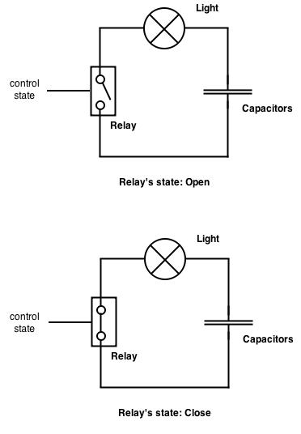
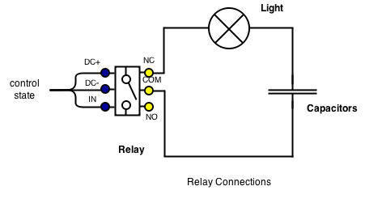
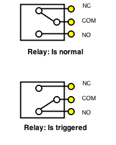
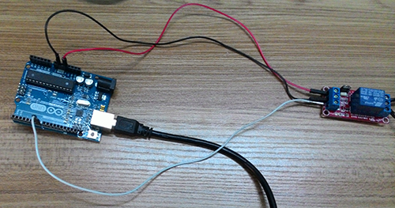
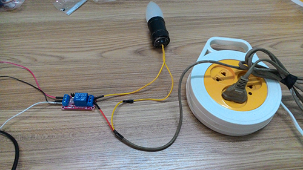
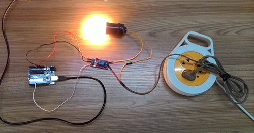

Chi tiết về bài viết, bạn có thể tham khảo tại: http://thuc.com.vn/relay-cong-tac-dien-va-cach-dung/

# Relay guide notes

Relay là một một dạng công tắc, thường dùng để đóng/mở dòng điện trong mạch. Không như những công tắc thông thường, sử dụng cơ học để đóng/mở, relay cho phép ta điều khiển việc đóng/mở thông qua tín hiệu điện truyền vào.

Trong điện tử, các chân của chip thông thường chỉ cung cấp dòng điện có hiệu điện thế khoảng 3.3-5V để điều khiển các thiết bị ngoại vi. Trong trường hợp muốn cấp điện cho thiết bị cần hiệu điện thế cao như quạt máy, đèn, tivi, mô tơ; relay có thể đáp ứng nhu cầu của một một cách hoàn hảo.

Hình ảnh về relay:


Trên thân của Relay, bạn sẽ thấy dòng chứ sau:
+ 10A 250VAC    10A 125VAC
+ 10A 30VDC     10A 28VDC
+ SRD-05VDC-SL-C

Nó có nghĩa là:
+ 10A 250VAC: Cường độ dòng điện tối đa qua các tiếp điểm có hiệu điên thế từ 250V (AC - điện xoay chiều) trở xuống là 10A
+ 10A 125VAC: Cường độ dòng điện tối đa qua các tiếp điểm có hiệu điên thế từ 125V (AC - điện xoay chiều) trở xuống là 10A
+ 10A 30VDC: Cường độ dòng điện tối đa qua các tiếp điểm có hiệu điên thế từ 30V (DC - điện 1 chiều) trở xuống là 10A
+ 10A 28VDC: Cường độ dòng điện tối đa qua các tiếp điểm có hiệu điên thế từ 28V (DC - điện 1 chiều) trở xuống là 10A
+ SRD-05VDC-SL-C: Hiệu điện thế dùng để kích là 5V

# Đặc tính của Relay

Vì là một dạng công tắc, relay sẽ có 2 thái đóng và mở.
+ Đóng (close): Khi ở trạng thái close, relay sẽ cho phép dòng điện chạy qua. Dòng điện có thể chạy qua relay, mạch kín.
+ Mở (open): Khi ở trạng thái open, relay sẽ ngắt dòng điện và không cho dòng điện chạy vào mạch. Ở trạng thái mày, mạch hở.



# Cấu tạo của Relay

Một relay thông thường sẽ có 6 cổng giao tiếp, 3 cổng dùng để điều khiển (điều khiển relay đóng hoặc mở) và 3 cổng còn lại để nối vào mạch điện , nơi mà ta muốn đóng hoặc mở dòng điện trong mạch.



Ba cổng dùng để điều khiển có ký hiệu như sau:
+ DC+: Cung cấp nguồn điện cho relay hoạt động. Cắm vào nguồn điện một chiều có hiệu điện thế từ 3.3-5V tùy vào relay.
+ DC-: Cung cấp nguồn điện cho relay hoạt động. Cắm vào GND (nối đất, cực âm, 0V).
+ IN: Chân tính hiệu, dùng để kích relay.

Ba cổng dùng để nối vào mạch điện:
+ COM (Common Connection): Dùng để nối vào nguồn điện. Nếu nguồn điện của bạn là một chiều thì nối cực dương vào đây. Nếu nguồn điện của bạn là xoay chiều thì nối cực âm vào đây.
+ NC (Normally Close): Chân này mặc định sẽ được nối vào chân COM khi không có bất kì tín hiệu nào hoặc không có lệnh kích hoạt nào đi vào chân IN. Nếu ta nối dây dẫn vào chân này và không kích hoạt relay (thông qua chân IN), dòng điện sẽ chạy từ chân COM qua chân NC. Khi kích hoạt relay (thông qua chân IN), dòng điện từ chân COM sang chân NC sẽ bị ngắt.
+ NO (Normally Open): Chân này sẽ không được nối vào chân COM khi chúng ta chưa kích hoạt relay (thông qua chân IN). Ban đầu, dòng điện sẽ không thể nào chạy từ chân COM vào chân NO được. Khi kích hoạt relay (thông qua chân IN), dòng điện sẽ chạy từ chân COM sang chân NO.

Để hiểu rõ về cách hoạt động của ba cổng COM, NC, NO khi ở trạng thái bình thường và khi kích hoạt, ta có thể tham khảo 2 mô hình sau



# Kích hoạt relay
Để kích hoạt relay (COM kết nối nối qua NO và ngắt kết nối với NC), ta thông qua chân IN để làm việc này. Trước khi nói về chân IN, chúng ta nên biết là có 2 loại relay, một loại lích hoạt kiểu thấp (LOW) và một loại kích hoạt kiểu cao (HIGH). Chúng ảnh hưởng trực tiếp đến cách thức kích relay trên chân IN.

## Relay kích hoạt kiểu thấp (LOW)
Với loại relay này, khi chúng ta kết nối chân IN với GND (nối đất, cực âm, 0V), relay sẽ được kích. Lúc đó COM sẽ kết nối vào NO và ngắt kết nối với NC. Khi chúng ta kết nối chân IN với cực dương 3.3V-5V, relay sẽ ở trạng thái bình thường. Lúc này COM sẽ kế nối vào NC và ngắt kết nối với NO


## Relay kích hoạt kiểu cao (HIGH)

Với loại relay này, khi chúng ta kết nối chân IN với GND (nối đất, cực âm, 0V), relay sẽ ở trạng thái bình thường (không được kích). Lúc đó COM sẽ kết nối vào NO và ngắt kết nối với NO. Khi chúng ta kết nối chân IN với cực dương 3.3V-5V, relay sẽ ở trạng thái kích. Lúc này COM sẽ kế nối vào NC và ngắt kết nối với NC


Vậy làm sao để phân biệt Relay bạn đang xài là kích hoạt kiểu LOW hay HIGH. Có 3 cách:
+ Hỏi người bán, người bán là người biết rõ về thứ họ bán cho bạn. Trừ khi họ nhầm lẫn :D
+ Tìm kiếm thông tin về transistor của relay đang dùng. Nếu transistor đó là loại NPN thì đấy chính là relay được kích hoạt ở mức HIGH. Nếu transistor đó là loại PNP thì đấy là relay được kích hoạt ở mức LOW.
+ Dùng thiết bị đo các chân hoặc cấp nguồn thử.


## Ví dụ thực tế

> Lưu ý: Ví dụ dưới đây có sử dụng đến dòng điện xoay chiều 220V. Nếu bạn không có nhiều những kinh nghiệm và kiến thức về nó, xin đừng thực hiện. Không nên làm những gì mình chưa hiểu rõ, nhất là với điện :) Nếu bạn quyết tâm làm, nhớ bảo vệ mình và hết sức cẩn thận.

Giả sử bạn có một bóng đèn dây tóc, sử dụng dòng điện xoay chiều 220V. Bạn muốn dùng mạch microcontroller arduino uno để điều khiển việc cứ sau mỗi 5 giây, đèn sẽ là bật hoặc tắt. 

Như bạn đã biết, aruidno uno chỉ cho phép bạn cung cấp dòng điện 5V ra chân OUTPUT. Với 5V này, bạn không cung cấp đủ điện thế cho bóng đèn dây tóc 220V sáng lên được. Vì vậy, bạn phải sử dụng một nguồn điện khác, mạng lưới điện 220V nhà bạn đang xài đủ tiêu chuẩn để làm việc đó. Nhưng làm sao bạn có thể điều khiển dòng điện 220V của nhà bạn để bóng đèn có thể bật hoặc tắt sau 5 giây được? Relay sẽ giúp bạn làm điều này.

### Chuẩn bị:


+ Arduino Uno Board (+ dây cắm máy tính)
+ Relay (trong ví dụ này mình dùng relay được kích ở mức LOW)
+ Dây cắm giữa Arduino uno và relay
+ Breadboard (nếu bạn muốn xài, trong ví dụ này mình không sử dụng breadboard)
+ Kềm, băng keo điện
+ Đèn

### Kết nối

Arduino kết nối với Relay theo sơ đồ sau:

| Aruino Pins    | Relay connections  |
| -------------- | ------------------ |
| 5V             | DC+                |
| GND            | DC-                |
| chân digital 7 | IN                 |




Relay kết nối với mạch theo sơ đồ sau:

| Relay connections | Circuit                               |
| ----------------- | ------------------------------------- |
| COM               | Dây nóng của nguồn điện (dây màu đỏ)  |
| NC                | Nối vào 1 đầu của bóng đèn            |

Đầu còn lại của bóng đèn thì nối vào dây trung hòa của nguồn điện




### Code

Do relay của mình kích ở mức LOW nên muốn bật đèn, mình sẽ write state LOW vào chân 7 của Arduino Uno. Muốn tắt đèn, mình sẽ write state HIGH vào chân 7 của Arduino.

Mình có viết một đoạn code nhỏ để demo ví dụ trên

```c++
int relayPin = 7;

void setup() {
  pinMode(relayPin, OUTPUT);
}

void loop() {
  digitalWrite(relayPin, LOW);
  delay(3000);
    digitalWrite(relayPin, HIGH);
  delay(3000);
}
```

### Hình kết quả




### Video
Để tiện đường coi, mình có quay một đoạn video nhỏ để các bạn tiện coi.
http://youtu.be/81GHj-mZJ5w

[](https://www.youtube.com/watch?v=81GHj-mZJ5w)
